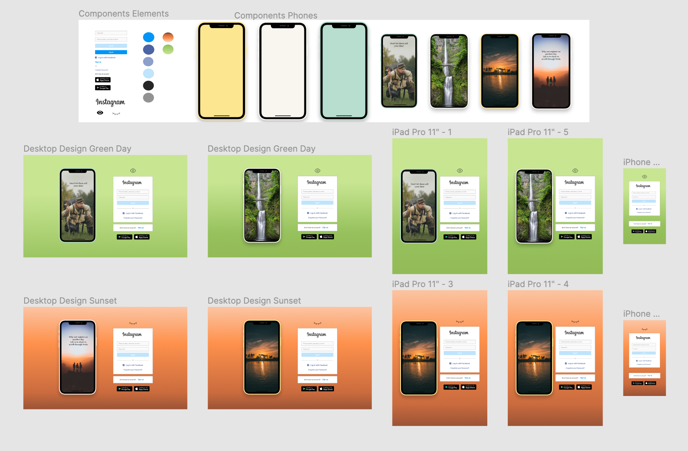

# Instagram log in componenent

## Welcome! 👋

Thanks for checking out my implementation for this instagram log in variation.
Please keep on reading if you are interested in my approach of organising this short project.
Don't take the message for the design to serious I tried to be witty ;).

The source code is raw on github and the running code is build by parcel on netlify.

The project is done by a desktop-first approach.

All designs templates, prototypes and basic functions are documented bellow &#8595;

## Documentation of the project

### Design personality

Designing this small project I wanted to keep the minimalist touch and add a bit of natural vibes to expose the countary of how life could be by not wasting time on social media. The idea of being out in nature is represented by the green color tones and the orangered color tone should represent the memories you can experience in the evening.

### Design Prototype

To make the layout more dynamic I added a toggle switch between these two states from above &#8593;

#### Mobile Prototype

- [Prototype Mobil](./Instagram_Login_Designs/Prototypes/iphone_prototype_SparkVideo_Low.gif)

#### Desktop Prototype

- [Prototype Desktop](./Instagram_Login_Designs/Prototypes/desktop_prototype_SparkVideo_Medium.gif)

### Architecture of functionality

Languages: HTML, CSS, SASS, JavaScript

CSS: css animatios are doing the functionality for changing the iphone background in an infite loop with a quick delay.

_JavaScript_:

The functions calls are straight forward. Two possible ways a user can interact with the UI.

- Mode toggle to change between morning and evening mode
- Sending form input to server for validation (Not implemented)

You can **preview** the project with this link!

- [GitHub Pages](https://social-log-in.netlify.app/

### Experience on the project

It was a great first approach of builiding is small project and adding your own touch and describe what you think about the project. There could be implemented many different features and components, but I will kee on buidling this project. Stay tuned to bigger projects on my repo.

### Specical thanks to the image providers

https://unsplash.com/@jentheodore
